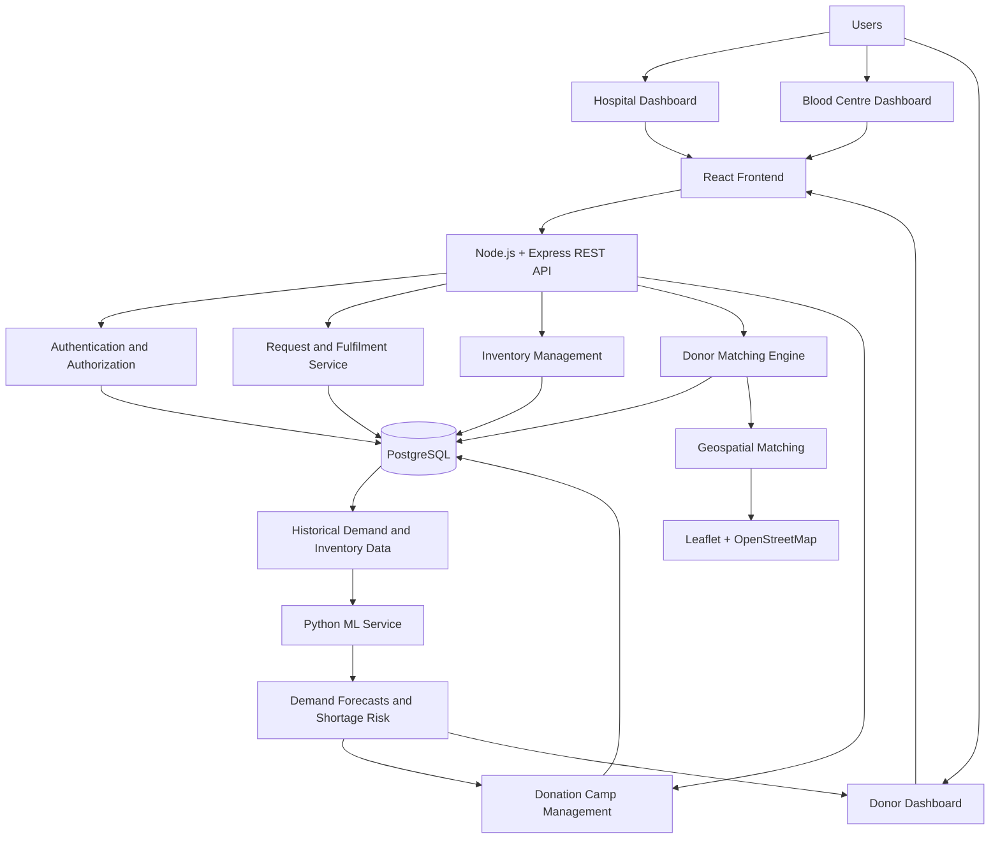
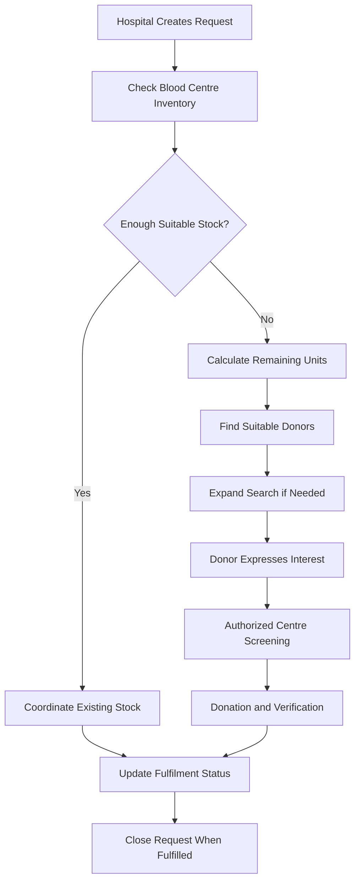
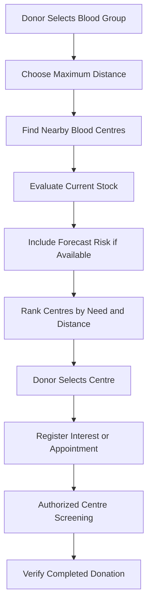
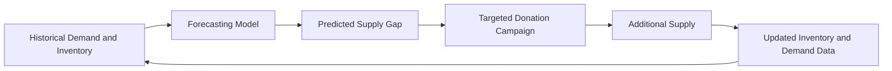

# 🩸 BloodLink
### Intelligent Emergency Blood Coordination & Demand Forecasting Platform

**Right blood. Right place. Right time.**

BloodLink is a healthcare coordination platform designed to connect hospitals, authorized blood centres, and voluntary donors through intelligent donor matching, blood inventory visibility, and predictive shortage forecasting.

Rather than relying entirely on manual communication during emergencies, BloodLink aims to streamline blood requests, coordinate donor responses, and help identify potential shortages before they become critical.

> **Our vision:** Move from reactive blood coordination to proactive blood availability.

---

## 📌 Table of Contents

- [The Problem](#-the-problem)
- [Our Solution](#-our-solution)
- [Key Features](#-key-features)
- [System Architecture](#-system-architecture)
- [Core Workflows](#-core-workflows)
- [Technology Stack](#-technology-stack)
- [Project Structure](#-project-structure)
- [Getting Started](#-getting-started)
- [Safety and Privacy](#-safety-and-privacy)
- [Future Scope](#-future-scope)
- [Team](#-team)

---

## 🚨 The Problem

Blood availability is not always aligned with where and when it is needed.

- **Fragmented coordination:** Hospitals may need to contact multiple blood centres and donors manually.
- **Limited inventory visibility:** Finding suitable nearby stock can take valuable time.
- **Inefficient donor matching:** Blood compatibility, location, availability, and donation history must be considered together.
- **Reactive donation drives:** Campaigns may not target the blood groups and locations facing the greatest need.
- **Limited traceability:** Requests, donor responses, donation verification, and inventory updates can remain disconnected.

Existing services such as e-RaktKosh provide valuable blood availability and blood-centre information. BloodLink focuses on an additional coordination layer for emergency fulfilment, donor engagement, and data-informed shortage prevention.

## 💡 Our Solution

BloodLink provides three distinct experiences through one connected platform.

| User | Primary responsibilities |
|---|---|
| 🏥 Hospital / Recipient | Create emergency requests, discover available stock, and track fulfilment. |
| 🩸 Blood Centre | Manage inventory, handle requests, coordinate appointments, and verify donations. |
| ❤️ Voluntary Donor | Respond to relevant emergencies, discover donation opportunities, and track verified donations. |

### Two ways to coordinate blood donations

**1. Emergency coordination**

When a hospital needs blood, BloodLink checks suitable blood-centre inventory first. If supply is insufficient, it identifies potential donors and progressively expands the search area.

**2. Regular donation recommendations**

Donors can discover nearby authorized blood centres where their blood group is in low supply or is predicted to face a shortage, subject to their preferred travel distance.

This allows BloodLink to support voluntary donation even when no emergency request is active.

---

## ✨ Key Features

### 🚑 Emergency Blood Coordination
- Create and track blood requests.
- Check existing blood-centre inventory before activating donor matching.
- Track units requested, fulfilled, and remaining.
- Support fulfilment from existing stock and multiple donor contributions.

### 🎯 Intelligent Donor Matching
- Consider blood-group and component compatibility.
- Use location, availability, and relevant donation history where available.
- Expand the search radius progressively: **2 km → 5 km → 10 km → 25 km**.
- Escalate notifications when the initial pool is insufficient.

### 📍 Donate Nearby
- Select a blood group and preferred travel distance.
- Discover nearby blood centres that need specific blood groups or components.
- View low-stock and critical-need indicators.
- Register interest in donating at a selected centre.
- Use predicted shortage indicators when forecasting data is available.

### 🗺️ Interactive Maps
- Display blood centres and donation camps geographically.
- Use Leaflet with OpenStreetMap tiles.
- Synchronize map markers with centre lists and distance filters.
- Support location-based discovery without requiring a Google Maps API key.

### 📦 Blood Inventory Management
- Organize inventory by blood group and component.
- Identify low-stock and critical-stock conditions.
- Update stock through the blood-centre interface.
- Track inventory updates and request fulfilment.

### 🤖 Predictive Shortage Forecasting
- Analyze historical demand and inventory.
- Estimate future demand and potential supply gaps.
- Identify blood groups and components that may need attention.
- Support targeted donation-camp recommendations.

### 🏕️ Donation Camps
- Discover upcoming camps.
- View camp dates and locations.
- Register interest in participating.
- Allow blood centres to manage camp information.

### 🔄 End-to-End Tracking
Track request progress through clear stages:

`Request Created → Inventory Checked → Donors Contacted → Screening → Donation Verified → Fulfilled`

A donor accepting a request does not automatically mean that blood has been donated or delivered.

---

## 🏗️ System Architecture

BloodLink follows a modular architecture that separates the user interface, core application logic, data storage, geospatial functionality, and machine-learning services.

### High-Level Architecture



*The diagram represents the intended logical architecture. Components that have not yet been implemented or connected should be treated as planned integrations rather than deployed services.*

### 1. Frontend Layer

**React + JavaScript + Tailwind CSS**

The frontend provides separate interfaces for hospitals, blood centres, and donors.

Responsibilities:
- Role-specific navigation and dashboards.
- Request creation and status tracking.
- Inventory and donor-opportunity displays.
- Interactive forms, filters, and visualizations.
- Responsive layouts for desktop and mobile.

Shared components help maintain consistent styling and behavior across all three experiences.

### 2. Backend Layer

**Node.js + Express.js + REST APIs**

The backend coordinates application workflows and acts as the central application service.

Responsibilities:
- Handle hospital blood requests.
- Manage inventory and request status.
- Coordinate donor matching.
- Validate user actions and requests.
- Apply role-based authorization.
- Store and retrieve application data.
- Communicate with a separate ML service if implemented.

REST APIs provide a consistent interface between the frontend and backend.

### 3. Database Layer

**PostgreSQL + Prisma ORM**

PostgreSQL stores structured application data, while Prisma provides database access through a schema and query interface.

Core entities may include:

| Entity | Purpose |
|---|---|
| Users | User accounts and roles |
| Hospitals | Hospital details and locations |
| Blood Centres | Centre profiles and service information |
| Inventory | Stock by blood group and component |
| Blood Requests | Required units, urgency, and fulfilment status |
| Donors | Donor profiles and preferences |
| Donation Records | Appointments and verified donation history |
| Donation Camps | Camp details and registrations |
| Forecasts | Predicted demand and shortage indicators |

Relationships between requests, centres, donors, and donation records support traceability across the workflow.

### 4. Geospatial Layer

**Leaflet + OpenStreetMap**

The geospatial layer supports location-based discovery and matching.

Responsibilities:
- Display nearby blood centres and donation camps.
- Filter centres by a donor's preferred distance.
- Calculate straight-line distances from valid coordinates.
- Support location-aware donor matching.
- Display map markers and relevant centre information.

Leaflet renders the map, while OpenStreetMap provides map tiles. These are separate from BloodLink's inventory and donor data.

Road routes and travel-time estimates require an appropriate routing service; they should not be inferred from straight-line distance.

### 5. AI/ML Layer

**Python + XGBoost + Time-Series Forecasting**

The ML layer is intended to help predict future blood demand and identify possible shortages.

Potential inputs:
- Historical demand by date and location.
- Blood group and component.
- Inventory and supply levels.
- Fulfilled and unfulfilled requests.
- Seasonal patterns and donation-camp activity.

Potential outputs:
- Predicted demand.
- Expected supply gap.
- Shortage-risk indicators.
- Recommended collection targets.

A separate **FastAPI** service can expose trained Python models to the Node.js backend through HTTP endpoints.

FastAPI is a planned integration unless the Python service has actually been implemented and connected.

---

## 🔄 Core Workflows

### Workflow 1 — Emergency Blood Request



BloodLink prioritizes suitable existing inventory before mobilizing additional donors. Requests can be fulfilled through multiple sources, with progress tracked at the unit level.

### Workflow 2 — Regular Donation Recommendation



This workflow connects voluntary donors with local demand without requiring an emergency request.

### Workflow 3 — Predictive Shortage Prevention



The forecasting loop is intended to help blood centres plan donation campaigns based on anticipated needs.

---

## 🛠️ Technology Stack

| Layer | Technologies |
|---|---|
| Frontend | React, JavaScript, Tailwind CSS |
| Backend | Node.js, Express.js, REST APIs |
| Database | PostgreSQL, Prisma ORM |
| Authentication | JWT, bcrypt |
| Maps | Leaflet, OpenStreetMap |
| AI/ML | Python, XGBoost, Time-Series Forecasting |
| ML API | FastAPI, if the separate service is implemented |
| API Testing | Postman |
| Deployment | Vercel, Render |

The stack describes the intended project architecture. The exact set of implemented technologies and deployed services should be confirmed against the current codebase.

---

## 📁 Project Structure

A suggested modular organization is:

```text
BloodLink/
├── frontend/
│   ├── components/
│   ├── pages/
│   │   ├── hospital/
│   │   ├── blood-centre/
│   │   └── donor/
│   ├── layouts/
│   ├── services/
│   ├── utils/
│   └── styles/
│
├── backend/
│   ├── routes/
│   ├── controllers/
│   ├── services/
│   ├── middleware/
│   ├── prisma/
│   └── server.js
│
├── ml-service/
│   ├── models/
│   ├── forecasting/
│   └── main.py
│
├── .env.example
├── package.json
└── README.md
```

This is an illustrative organization, not a claim about the current repository's exact folder structure. Keep the existing project structure if it already follows a different convention.

---

## 🚀 Getting Started

### Prerequisites

- Node.js and npm.
- Git.
- PostgreSQL, if the application uses a PostgreSQL database.
- Python, if the separate ML service is implemented.

### Installation

**1. Clone the repository**

```bash
git clone <YOUR_GITHUB_REPOSITORY_URL>
cd <YOUR_PROJECT_FOLDER>
```

**2. Install dependencies**

Run the command in the directory containing the relevant `package.json`:

```bash
npm install
```

**3. Configure environment variables**

Create a `.env` file using the variables required by the existing application.

Example:

```env
DATABASE_URL=your_database_connection_string
JWT_SECRET=your_secret_value
```

These are examples only. Use the actual variable names required by the codebase. Never commit credentials or API secrets.

**4. Configure the database**

If Prisma and PostgreSQL are configured:

```bash
npx prisma generate
npx prisma migrate dev
```

Run migrations only after configuring the correct database and reviewing the existing Prisma schema.

**5. Start the application**

```bash
npm run dev
```

If the project has separate frontend, backend, or ML services, start them using the scripts documented in their respective directories.

**6. Build for deployment**

```bash
npm run build
```

Use the build script defined by the project. Ensure the dependency versions are compatible before deploying to Vercel.

---

## 🔐 Safety and Privacy

BloodLink is a coordination platform, not a blood collection or medical screening service.

- Final donor eligibility is determined by qualified personnel at an authorized blood centre.
- Blood collection, testing, processing, and transfusion must follow applicable regulations and clinical procedures.
- Donor contact information, home addresses, and medical details must be protected through appropriate access controls.
- Role-based permissions must be enforced by the backend, not only by hiding frontend controls.
- Donations remain voluntary and non-remunerated.
- Inventory, locations, and predictions must be clearly labelled when simulated.
- External integrations must use authorized interfaces and permissions.

---

## 🔮 Future Scope

- Authorized integration with blood-centre information systems and e-RaktKosh, subject to available APIs and permissions.
- Real-time inventory synchronization.
- SMS, email, and push notifications.
- More advanced demand forecasting using historical and seasonal data.
- Rare blood-group escalation workflows.
- Geographic shortage heatmaps.
- Improved donation-camp planning.
- Forecast accuracy evaluation and operational analytics.
- Stronger verification and privacy safeguards.

---

## 📊 Expected Impact

BloodLink aims to improve blood coordination through measurable outcomes:

- Reduced time to identify suitable available stock.
- Faster coordination of emergency requests.
- Improved request fulfilment rates.
- Better donor response rates.
- More targeted voluntary donation campaigns.
- Earlier identification of potential shortages.

These are intended outcomes, not yet proven results. A real pilot should evaluate request fulfilment time, percentage of units fulfilled, donor response rate, and forecasting accuracy.

---

## 👥 Team

**Team Name:** SPITRangers

**Team ID:** To be announced

**Institution:** Sardar Patel Institute of Technology (SPIT)

**Team Members:**
- Param Gupta
- Dhruv Jain
- Viyom Jain
- Aryan Kumbhar

**Domain:** Healthcare Technology · AI/ML · Social Impact

---

## 📚 References

- [World Health Organization — Blood Safety and Availability](https://www.who.int/news-room/fact-sheets/detail/blood-safety-and-availability)
- [Government of India — e-RaktKosh](https://eraktkosh.mohfw.gov.in/eraktkoshPortal/)
- [Government of India — National Standards for Blood Centres](https://www.mohfw.gov.in/sites/default/files/National%20Standards%20for%20Blood%20Centres.pdf)
- [Leaflet Documentation](https://leafletjs.com/)
- [OpenStreetMap Tile Usage Policy](https://operations.osmfoundation.org/policies/tiles/)
- [FastAPI Documentation](https://fastapi.tiangolo.com/)
- [XGBoost Documentation](https://xgboost.readthedocs.io/)

---

<div align="center">

### 🩸 BloodLink

**Connecting urgent needs with coordinated action.**

*Built by SPITRangers.*

</div>
